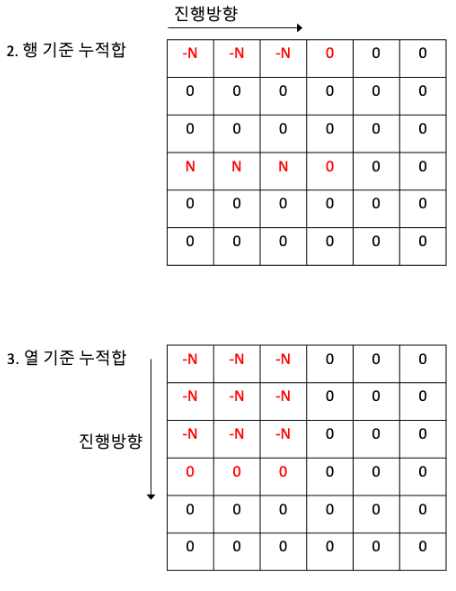

# 92344 파괴되지 않은 건물


####  순수한 풀이
```python
def solution(board, skill):
    # 건물 0이하 파괴
    # 회복 스킬로 내구도 상승

    normal = 0
    # 파괴되지 않은 건물 수 return
    for i in range(len(skill)):
        if(skill[i][0]==1):
            for p in range(skill[i][1], skill[i][3]+1):
                for q in range(skill[i][2], skill[i][4]+1):
                    board[p][q] = board[p][q] - skill[i][5]
        elif(skill[i][0]==2):
            for p in range(skill[i][1], skill[i][3]+1):
                for q in range(skill[i][2], skill[i][4]+1):
                    board[p][q] = board[p][q] + skill[i][5]

    for i in range(len(board)):
        for j in range(len(board[i])):
            if(board[i][j] > 0):
                normal = normal + 1

    return normal
```

#### 누적 합 활용 풀이

- 누적합을 어떻게 활용하였는지?
Q. 아래와 같은 1차원 배열에서 0~2번째 인덱스까지 N만큼 감소하는 상황 가정

    

    아래와 같은 임시 배열을 만든 후 위의 배열과 더해준다.
    

근데 문제에서는 2차원 배열이라 조금 다른 과정이 필요함.
아래와 같이 행 기준, 열 기준 누적합 배열을 생성후
원래 배열과 더해주면 됨.



순수한 풀이에서는 시간복잡도가 250000 * 1000 * 1000였는데
누적합 풀이에서는 250000 + 1000 * 1000으로 줄어듬.

```python
def solution(board, skill):
    # 건물 0이하 파괴
    # 회복 스킬로 내구도 상승

    normal_cnt = 0
    # 임시 누적합 배열 생성
    sum_board = [[0] * (len(board[0]) + 1) for _ in range(len(board) + 1)]

    # 누적합 배열 만드는 과정
    for typ, r1, c1, r2, c2, degree in skill:
        if(typ== 2):
            sum_board[r1][c1] += degree
            sum_board[r1][c2 + 1] += -degree
            sum_board[r2 + 1][c1] += -degree
            sum_board[r2 + 1][c2 + 1] += degree
        else:
            sum_board[r1][c1] += -degree
            sum_board[r1][c2 + 1] += degree
            sum_board[r2 + 1][c1] += degree
            sum_board[r2 + 1][c2 + 1] += -degree

    # [[-4, -1, 0, 0, 1, 4], [2, 0, -2, 0, 0, 0], [-2, 0, 0, 0, 2, 0], [2, 0, 0, 0, -2, 0], [2, 1, 2, 0, -1, -4]]

    # 행 기준 누적합
    for i in range(len(sum_board) - 1):
        for j in range(len(sum_board[0]) - 1):
            sum_board[i][j + 1] += sum_board[i][j]

    # 열 기준 누적합
    for j in range(len(sum_board[0]) - 1):
        for i in range(len(sum_board) - 1):
            sum_board[i + 1][j] += sum_board[i][j]

    # [[-4, -5, -5, -5, -4, 0], [-2, -3, -5, -5, -4, 0], [-4, -5, -7, -7, -4, 0], [-2, -3, -5, -5, -4, 0], [0, -2, -3, -5, -5, -4]]

    # 기존 배열과 합하여, 파괴되지 않은 건물 count
    for i in range(len(board)):
        for j in range(len(board[i])):
            board[i][j] += sum_board[i][j]
            if board[i][j] > 0:
                normal_cnt += 1


    return normal_cnt
```